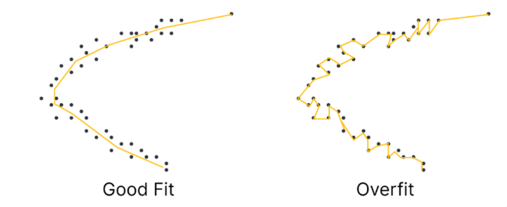

# OverFitting

Overfitting refers to a model that models the training data too well. Overfitting happens when a model learns the details the details and noise in the training dataset to the extent that it negatively impacts the performance of the model.

> Sign that the model has Overfitted: High Training data Accuracy & very low Test data Accuracy

### Causes for Overfitting

1. Less Data
2. Increased Complexity of the model

### Preventing Overfitting by

1. Using more data
2. Bias - Variance Tradeoff
3. Use Dropouts
