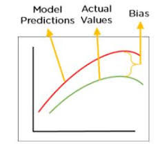
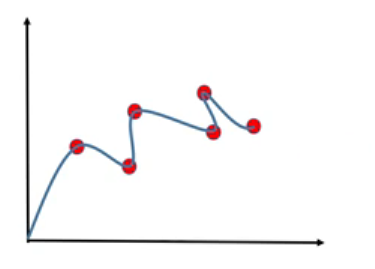

# Bias-Variance

1. Bias:
    . Bias tells about difference between the model prediction and the actual value which we are trying to predict.
    . Bias Variation affect model performance

2. Variance:
    . Variance is the amount that the estimate of the target function will change if different training data was used

#### States for Bias and Variance

1. **High Bias, Low Variance:**
    . The model is too simple and doesn't fit the data well, leading to underfitting.
    . Performance is poor on both training and test data.
2. **Medium Bias, Medium Variance:**
    . The model captures some patterns but still misses some important complexity.
    . There is a balance between underfitting and overfitting.
    . The model performs decently but might still struggle with complex patterns.
3. **Low Bias, High Variance:**
    . The model is too complex and fits not just the true patterns but also the noise, leading to overfitting.
    . It performs well on training data but poorly on test data due to overfitting.

