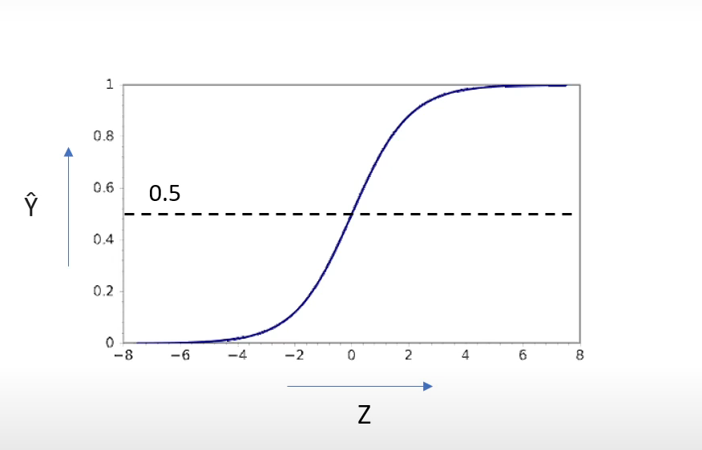

# Maths Behind Logistic Regression

### Understand the Sigmoid Function

---

$$\{z = w \cdot x + b}\$$

- where:
  - w is the weight of the features (vector form) (A.K.A model coefficients),
  - x is the feature (input data),
  - b is the bias term (A.K.A model intercept) .
  - $z$ is known as logits

$$\{\text{Sigmoid Function } \hat{y} = \frac{1}{1 + e^{-z}}}\$$

- where:
  - $\hat{y}$ is the predicted probability of the class.
  - Here, we transform logits into probability.
  - The output of the sigmoid function will always be between 0 and 1, which makes it interpretable as a probability.

> Then, we set categorize the probability into discrete values by threshold mostly >0.5 is True class(1) and <0.5 is False class(0)

## WORKFLOW (Binary Classification)

1. **Initialize Model Parameters**
   - Set the **learning rate** (e.g., 0.01) and **number of epochs**.
   - Initialize **weights** and **bias** to small random values or zeros.

2. **Forward Propagation**
   - Calculate the **logits** \(z = w \cdot x + b\), where \(w\) is the weight vector, \(x\) is the input, and \(b\) is the bias.
   - Apply the **sigmoid function** to transform logits \(z\) into probabilities \(\hat{y} = \frac{1}{1 + e^{-z}}\).

3. **Compute Loss**
   - Use a loss function, such as **binary cross-entropy**:

4. **Backward Propagation**
   - Compute the **gradients** of the loss function with respect to the weights (\(w\)) and bias (\(b\)).

5. **Update Parameters**
   - Use **gradient descent** to update weights and bias:
     $$
     w = w - \alpha \cdot \frac{\partial \text{Loss}}{\partial w}
     $$
     $$
     b = b - \alpha \cdot \frac{\partial \text{Loss}}{\partial b}
     $$
     where \(\alpha\) is the learning rate.

6. **Repeat Steps 2–5**
   - Iterate through the forward and backward propagation steps for the specified number of epochs or until convergence (when the loss stops decreasing significantly).

7. **Prediction**
   - After training, use the learned weights and bias to predict probabilities for new data.
   - Apply a threshold (e.g., \(\hat{y} > 0.5\)) to classify probabilities into discrete class labels (0 or 1).

---
